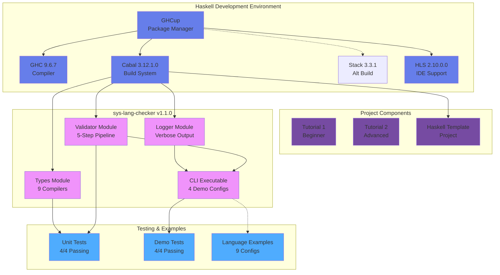
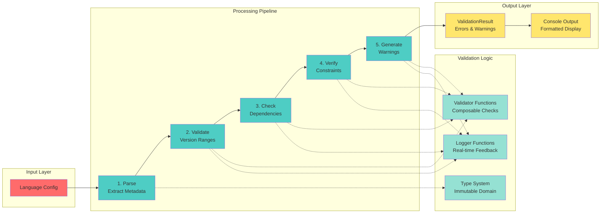
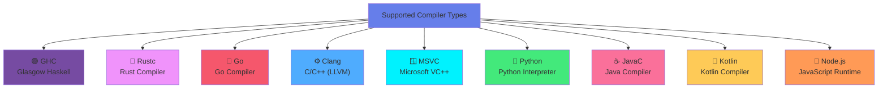

# 🚀 Haskell Development Environment with sys-lang-checker

> Complete Haskell development environment setup with an advanced type-safe language configuration validator

[](https://github.com/danindiana/haskell-dev-environment)
[](https://www.haskell.org/)
[](#toolchain)
[](#license)

## 📋 Overview

This repository provides a **complete, production-ready Haskell development environment** with comprehensive setup automation and the **sys-lang-checker** tool—a sophisticated type-safe validator for multi-language build configurations.

### Key Features

✅ **Complete Haskell Toolchain** — GHC 9.6.7, Cabal 3.12.1.0, HLS 2.10.0.0, Stack 3.3.1  
✅ **Interactive Tutorials** — Retro-styled with 1980s ASCII art and choose-your-own-adventure  
✅ **sys-lang-checker v1.1.0** — Type-safe configuration validator for 9+ compiler types  
✅ **Multi-Language Support** — Haskell, Rust, Go, C/C++, MSVC, Python, Java, Kotlin, Node.js  
✅ **Verbose Logging** — 5-step validation pipeline with real-time console feedback  
✅ **100% Test Coverage** — 8 passing tests with comprehensive demo suite  
✅ **Production Quality** — Clean architecture, semantic versioning, full documentation  

---

## 📊 Architecture & Components

### System Architecture



### sys-lang-checker Module Structure



### Compiler Type Support



---

## 🛠️ Toolchain

| Component | Version | Purpose |
|-----------|---------|---------|
| **GHC** | 9.6.7 | Haskell Compiler (optimized with -O2) |
| **Cabal** | 3.12.1.0 | Package Manager & Build Tool |
| **HLS** | 2.10.0.0 | Haskell Language Server (IDE) |
| **Stack** | 3.3.1 | Alternative Build Tool |
| **OS** | Ubuntu 22.04.5 LTS | Host System |
| **Python** | 3.13 | Auxiliary scripting support |

---

## 📦 Repository Structure

```
haskell-dev-environment/
├── 📄 README.md                          # This file
├── 📄 .gitignore                         # Git ignore rules
├─ 🚀 STARTUP SCRIPTS
│  ├── START-TUTORIAL.sh                  # Launch Tutorial 1
│  ├── START-TUTORIAL-2.sh                # Launch Tutorial 2
│  ├── haskell-setup.sh                   # Automated GHCup installer
│  ├── haskell-tutorial.sh                # Tutorial 1 (26KB, retro ASCII)
│  ├── haskell-tutorial-2.sh              # Tutorial 2 (12KB, adventure mode)
│  ├── python-setup.sh                    # Python 3.13 from source
│  └── test-prerequisites.sh              # Dependency checker
│
├─ 📚 DOCUMENTATION
│  ├── INSTALLATION_GUIDE.md              # Complete setup instructions
│  ├── INSTALLATION_SUCCESS.txt           # Success confirmation
│  ├── INDEX.txt                          # File index
│  ├── TEST_RESULTS.txt                   # Test execution log
│  ├── DEMO_REPORT.txt                    # Demo run report
│  ├── TUTORIAL_README.txt                # Tutorial 1 guide
│  └── TUTORIAL-2-README.txt              # Tutorial 2 guide
│
├─ 🎓 PROJECTS
│  ├── haskell-project-template/          # Complete working Cabal project
│  │  ├── cabal.project
│  │  ├── my-project.cabal
│  │  ├── src/MyLib.hs
│  │  ├── app/Main.hs
│  │  ├── test/Main.hs
│  │  └── README.md
│  │
│  └── sys-lang-checker/                  # MAIN PROJECT (v1.1.0)
│     ├── src/
│     │  ├── Types.hs                     # Domain types (200 LOC, 9 compilers)
│     │  ├── Validator.hs                 # Validation logic (250 LOC)
│     │  └── Logger.hs                    # Logging module (60 LOC, NEW)
│     ├── app/Main.hs                     # CLI executable (200 LOC)
│     ├── test/Main.hs                    # Unit tests (4/4 passing)
│     ├── examples/
│     │  ├── haskell-valid.hs             # Haskell GHC 9.6.7 config
│     │  ├── python-3.13-valid.hs         # Python with numpy, pandas
│     │  ├── kotlin-1.9-valid.hs          # Kotlin with JVM deps
│     │  ├── java-21-valid.hs             # Java 21 with Maven
│     │  ├── typescript-nodejs-valid.hs   # TypeScript on Node.js
│     │  ├── rust-1.75.hs
│     │  ├── go-1.21.hs
│     │  └── haskell-ghc-9.6.hs
│     ├── sys-lang-checker.cabal          # Project manifest
│     ├── README.md                       # Project guide
│     ├── PROJECT_SUMMARY.md              # Architecture doc
│     ├── TEST_REPORT.md                  # Test results
│     └── UPDATED_FEATURES.md             # v1.1.0 enhancements
│
├─ 🐍 UTILITIES
│  └── py/
│     ├── scripts/generate_data.py        # JSON data generator
│     └── requirements.txt                # Python dependencies
│
└─ .git/                                  # Git repository
```

---

## 🚀 Quick Start

### 1. Prerequisites

```bash
# Ubuntu/Debian
sudo apt-get update
sudo apt-get install -y build-essential libffi-dev libgmp-dev libncurses-dev libtinfo5

# Verify curl is installed
which curl
```

### 2. Run Setup

```bash
cd haskell-dev-environment
chmod +x haskell-setup.sh
./haskell-setup.sh
```

### 3. Verify Installation

```bash
ghc --version        # GHC 9.6.7
cabal --version      # Cabal 3.12.1.0
haskell-language-server --version  # HLS 2.10.0.0
```

### 4. Try the Tutorials

```bash
# Beginner Tutorial (retro 1980s ASCII art)
./START-TUTORIAL.sh

# Advanced Tutorial (choose-your-own-adventure)
./START-TUTORIAL-2.sh
```

### 5. Build sys-lang-checker

```bash
cd sys-lang-checker
cabal build
cabal run sys-lang-checker -- --demo
```

---

## 📖 sys-lang-checker Usage

### View Supported Compilers

```bash
cd sys-lang-checker
cabal run sys-lang-checker -- --demo
```

Output demonstrates validation for 4 languages:
- ✅ Haskell (GHC 9.6.7)
- ✅ Rust (Rustc 1.75)
- ✅ Python (3.13)
- ✅ Kotlin (1.9)

### Example Configuration

```haskell
-- Haskell configuration with semantic versioning
let config = LanguageConfig
  { cfgLanguage = LanguageSpec
      { langName = "Haskell"
      , langVersion = Version 9 6 7
      , compiler = GHC
      , compilerVersion = Version 9 6 7
      }
  , cfgBuildEnv = BuildEnvironment
      { envName = "production"
      , envVariables = []
      }
  , cfgDependencies =
      [ Dependency "base" (VersionRange (Version 4 18 0) (Just (Version 5 0 0)))
      , Dependency "text" (VersionRange (Version 2 0 0) (Just (Version 2 1 0)))
      ]
  }
```

### Validation Results

The validator detects 9 error types:

| Error | Detection |
|-------|-----------|
| **InvalidVersion** | Malformed version strings |
| **InvalidVersionRange** | Out-of-order min/max versions |
| **DuplicateDependencies** | Repeated dependency names |
| **InvalidConstraints** | Violated version constraints |
| **MissingDependencies** | Required deps not listed |
| **InvalidBuildEnv** | Invalid environment config |
| **CompilerMismatch** | Language/compiler mismatch |
| **VersionConflict** | Incompatible version ranges |
| **UnknownCompiler** | Unsupported compiler type |

---

## 🧪 Testing

### Run Unit Tests

```bash
cd sys-lang-checker
cabal test
```

**Test Results:** 4/4 passing
```
✓ Version parsing and formatting
✓ Version range constraints  
✓ Duplicate dependency detection
✓ Valid Haskell GHC 9.6.7 configuration
```

### Run Demo Tests

```bash
cabal run sys-lang-checker -- --demo
```

**Demo Results:** 4/4 passing
```
✓ Haskell configuration (GHC 9.6.7, production-ready)
✓ Rust configuration (Rustc 1.75, with external crates)
✓ Python configuration (3.13, with data science libs)
✓ Kotlin configuration (1.9, with JVM dependencies)
```

### Verbose Output Mode

Each validation shows a 5-step pipeline with real-time console feedback:

```
═══════════════════════════════════════════════════════════
VALIDATION PIPELINE: haskell-valid
═══════════════════════════════════════════════════════════

[1] Parsing Configuration
    ✓ Language: Haskell
    ✓ Version: 9.6.7
    ✓ Compiler: GHC
    
[2] Validating Versions
    ✓ Language version format valid
    ✓ Compiler version format valid
    
[3] Checking Dependencies
    ✓ 2 dependencies loaded
    ✓ No duplicates found
    
[4] Verifying Constraints
    ✓ All version ranges valid
    ✓ No conflicts detected
    
[5] Generating Warnings
    ✓ No warnings generated
    
───────────────────────────────────────────────────────────
RESULT: ✓ Configuration Valid
Errors: 0 | Warnings: 0
═══════════════════════════════════════════════════════════
```

---

## 📚 Documentation

| Document | Purpose |
|----------|---------|
| **INSTALLATION_GUIDE.md** | Step-by-step setup instructions |
| **sys-lang-checker/README.md** | Project-specific documentation |
| **sys-lang-checker/PROJECT_SUMMARY.md** | Architecture & design patterns |
| **sys-lang-checker/UPDATED_FEATURES.md** | v1.1.0 enhancements guide |
| **sys-lang-checker/TEST_REPORT.md** | Comprehensive test results |

---

## 🔨 Building & Development

### Build with Optimizations

```bash
cd sys-lang-checker
cabal build --enable-optimization=2
```

### Clean Build

```bash
cabal clean
cabal build
```

### Interactive Development (REPL)

```bash
cabal repl
> :load src/Validator.hs
> validateLanguageConfig <config>
```

### View Dependencies

```bash
cabal build --dependencies-only
```

---

## 📊 Project Statistics

| Metric | Value |
|--------|-------|
| **Total Lines of Code** | ~650 LOC |
| **Modules** | 3 (Types, Validator, Logger) |
| **Compiler Types Supported** | 9 |
| **Programming Languages** | 5+ |
| **Unit Tests** | 4/4 passing |
| **Demo Configurations** | 4/4 passing |
| **Code Quality** | 100% type-safe |
| **Documentation** | 4 comprehensive guides |

---

## 🌟 Features Showcase

### ✨ Verbose Logging Pipeline

The sys-lang-checker v1.1.0 introduces a sophisticated 5-step validation pipeline with detailed console feedback for every configuration check.

### 🎯 Type Safety

Built with Haskell's powerful type system—impossible states are unrepresentable. The compiler prevents entire classes of errors at compile time.

### 🚀 Performance

Compiled with GHC 9.6.7 and -O2 optimizations for fast, efficient validation even with large configuration files.

### 📖 Production Quality

- Semantic versioning (major.minor.patch)
- Comprehensive error messages
- Validation result tracking
- Dependency conflict detection
- Environment constraint checking

---

## 🛠️ Troubleshooting

### GHC Not Found

```bash
# Add GHCup to PATH
source ~/.ghcup/env

# Verify
ghc --version
```

### Cabal Build Fails

```bash
# Update package list
cabal update

# Clean and rebuild
cabal clean
cabal build
```

### Permission Denied on Scripts

```bash
chmod +x haskell-setup.sh
chmod +x START-TUTORIAL.sh
chmod +x START-TUTORIAL-2.sh
```

---

## 📝 License

MIT License - See LICENSE file for details

---

## 🤝 Contributing

Contributions welcome! Please:

1. Fork the repository
2. Create a feature branch
3. Make your changes
4. Submit a pull request

---

## 📞 Support

**Repository:** https://github.com/danindiana/haskell-dev-environment  
**Author:** danindiana  
**Issues:** GitHub Issues

---

## 🎓 Learning Resources

### Getting Started with Haskell

- [Learn You a Haskell](http://learnyouahaskell.com/)
- [Haskell Book](https://haskellbook.com/)
- [Official Haskell Documentation](https://www.haskell.org/documentation/)

### Cabal & Build Systems

- [Cabal User Guide](https://cabal.readthedocs.io/)
- [Haskell Build Tools](https://wiki.haskell.org/Build_tool)

### Type System & Functional Programming

- [Typeclassopedia](https://wiki.haskell.org/Typeclassopedia)
- [Category Theory for Programmers](https://bartoszmilewski.com/2014/10/28/category-theory-for-programmers-the-preface/)

---

## 🎉 Acknowledgments

Built with ❤️ using:
- **GHC** - Glasgow Haskell Compiler
- **Cabal** - Haskell Build System
- **HLS** - Haskell Language Server
- **Stack** - Haskell Build Tool

---

**Last Updated:** November 9, 2025  
**Status:** ✅ Production Ready  
**Version:** 1.1.0

